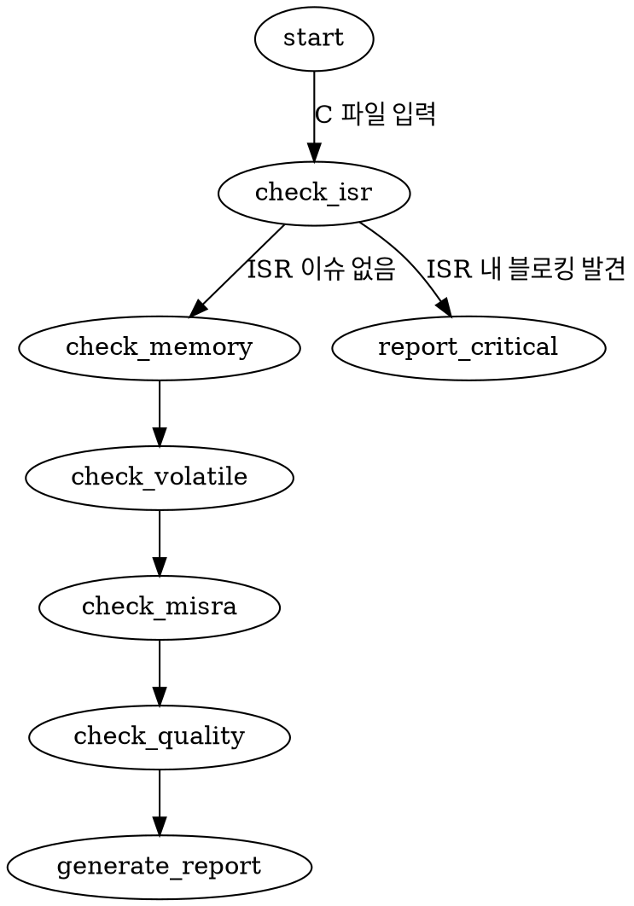

# 누락된 리서치 인사이트 10개 — 정리 및 반영 방향

---

## 인사이트 1: Superpowers 7단계 강제 워크플로우
**출처**: obra/superpowers (42K stars)

**내용**:
Superpowers의 핵심은 개별 스킬이 아니라, 7단계를 **건너뛸 수 없게 강제**하는 것.
1. Brainstorming (소크라테스식 질문으로 요구사항 정제)
2. Design (설계를 "읽을 수 있는 분량"으로 나눠 확인)
3. Plan (주니어 엔지니어도 따를 수 있는 구현 계획)
4. TDD (테스트 먼저. 없으면 코드 삭제)
5. Subagent Development (태스크별 독립 에이전트)
6. Code Review (스펙 준수 + 코드 품질 2단계)
7. Completion (검증 후 완료)

Claude가 수시간 자율적으로 작업하면서도 계획에서 벗어나지 않는 이유가 이 구조.

**v4에서 빠진 이유**: 워크플로우 체인을 그리긴 했지만, "단계를 건너뛸 수 없는 메커니즘"이 없음. 그냥 화살표만 그려놓은 것.

**반영 방향**:
- CLAUDE.md에 "개발 순서 강제" 섹션 추가
- "테스트 없이 구현 코드를 제출하지 않는다" 같은 hard rule 정의
- Claude Code에서는 hook으로, claude.ai에서는 SKILL.md 내 강제 조건으로 구현
- 다만, 우리 환경은 Superpowers처럼 서브에이전트를 수시간 돌리는 게 아님
  → **우리에게 맞는 수준으로 축소 적용**하되, "설계→테스트→구현→리뷰" 순서 강제는 반영

**논의 포인트**: 우리 팀의 실제 개발 흐름에서 이 강제가 현실적인가?
iTask 기반 펌웨어 개발에서 TDD가 어느 정도까지 적용 가능한가?

---

## 인사이트 2: GraphViz dot 표기 — Claude가 플로우차트를 더 잘 따름
**출처**: Superpowers 4.0+ 내부 문서화 방식

**내용**:
Superpowers 4.0부터 내부 프로세스 문서를 **GraphViz dot 표기**로 작성.
이유: "Claude는 산문(prose)보다 플로우차트를 더 정확하게 따른다."
dot으로 표현된 분기/조건/반복을 Claude가 모호함 없이 실행.

**v4에서 빠진 이유**: 완전 누락. SKILL.md 작성 방식론 자체를 다루지 않았음.

**반영 방향**:
- 스킬 내부의 복잡한 판단 로직(특히 mcu-code-reviewer의 6종 분기, debug-strategist의 4단계)을 dot 표기로 작성
- 예시:

- 모든 스킬의 판단 플로우를 dot으로 하자는 게 아니라, **분기가 복잡한 스킬**에만 적용
- 대상: B1(mcu-code-reviewer), D1(debug-strategist), 워크플로우 체인 자체

**논의 포인트**: dot 표기가 SKILL.md 가독성을 떨어뜨리지 않는가?
references/에 dot 파일을 넣고 SKILL.md에서 참조하는 것이 나을 수 있음.

---

## 인사이트 3: NeoLab 6종 전문 리뷰어 에이전트 패턴
**출처**: NeoLabHQ/code-review

**내용**:
하나의 "코드 리뷰어"가 아니라, 6개의 전문화된 리뷰 에이전트를 독립 실행:
- bug-hunter: 버그 탐지
- security-auditor: 보안 취약점
- code-quality-reviewer: 코드 품질
- contracts-reviewer: API 계약 검증
- historical-context-reviewer: **git 히스토리 기반** 리뷰
- test-coverage-reviewer: 테스트 커버리지

핵심: 각 에이전트가 **자기 관점에서만** 리뷰하므로 깊이가 다름.

**v4에서 반영 상태**: B1에 "6종 리뷰어"라고 표로 나열은 했지만,
NeoLab 원본의 핵심인 **"독립 실행"과 "git 히스토리 기반 리뷰"**가 빠짐.

**반영 방향**:
- B1의 6종 리뷰어를 실제로 독립 관점에서 동작하도록 SKILL.md에 명시
  (Claude Code: 서브에이전트 위임 / claude.ai: 순차적이지만 관점별 패스)
- **historical-context-reviewer 추가 검토**:
  "이 함수가 최근 3번 수정됐는데, 이번 변경이 이전 수정 의도와 충돌하지 않는가?"
  → git log 기반 분석은 Claude Code에서만 가능, claude.ai에서는 수동 제공 필요
- **MCU 특화 리뷰어 재설계**:
  NeoLab의 6종을 그대로 쓰는 게 아니라, MCU 도메인에 맞게 재조합

**논의 포인트**: 6종 전부 매번 실행하면 느리고 토큰 소모가 큼.
"CRITICAL 카테고리만 항상 실행, 나머지는 선택" 같은 티어링이 필요한가?

---

## 인사이트 4: Semantic Duplicate Finder — 의도 기반 중복 탐지
**출처**: obra/superpowers-lab (실험적 스킬)

**내용**:
구문적 복사(copy-paste)가 아닌, **같은 의도의 다른 구현**을 탐지.
예: 두 파일에 각각 "ADC 초기화" 코드가 있는데, 구현이 약간 다름.
2단계 접근:
1. Haiku로 함수를 도메인별 분류 (빠르고 저렴)
2. Opus로 각 카테고리 내 의미적 중복 분석 (정밀)

**v4에서 빠진 이유**: 완전 누락. 어떤 스킬에도 반영되지 않음.

**반영 방향**:
- MCU에서 특히 가치 있는 상황:
  - 여러 제품(Accura 2700/2750)에서 유사 주변장치 초기화 코드 중복
  - 동일 프로토콜(Modbus)의 서로 다른 구현이 공존
  - ISR 핸들러 패턴이 모듈마다 약간 다르게 작성
- **독립 스킬로 만들기보다는**, B1(mcu-code-reviewer)의 선택적 리뷰 항목으로 추가
  - "코드베이스 전체 스캔" 모드에서만 활성화
  - 일상적 리뷰에서는 비활성

**논의 포인트**: 이건 Claude Code에서만 실용적 (전체 소스 트리 접근 필요).
claude.ai에서는 "이 파일과 비슷한 구현이 다른 곳에 있나요?" 같은 수동 질문 형태.

---

## 인사이트 5: K-Dense Scientific Skills — 공학 분석 스킬 선례
**출처**: K-Dense/Claude Scientific Skills

**내용**:
과학/공학 분석에 특화된 스킬 세트. 평가: "PhD 과정 대신 이 문서를 읽으라."
전문 라이브러리(numpy, scipy, sympy 등)와 데이터베이스를 활용한 계산 기반 분석.

**v4에서 빠진 이유**: B6(precision-analyzer)에 개념만 있고,
"공학 분석 스킬은 이렇게 만들면 된다"는 방법론이 빠짐.

**반영 방향**:
- B6(precision-analyzer)에 **계산 스크립트** 포함:
  - scripts/precision_calc.py: ADC 분해능, 오차 전파, RSS 계산
  - 입력: 회로 파라미터 JSON/YAML → 출력: 분석 리포트
- references/에 **공학 공식 레퍼런스** 포함:
  - adc-error-model.md: DNL, INL, 양자화 오차, 노이즈 모델
  - ieee43-reference.md: 절연저항 측정 기준
- K-Dense 접근법 채용: "설명만 하지 말고, 계산도 해라"

**논의 포인트**: precision-analyzer를 쓰는 빈도가 높지 않을 수 있음.
그래도 Accura 2750IRM 같은 정밀 측정 장비 개발에서는 결정적 가치.

---

## 인사이트 6: Progressive Disclosure / 토큰 예산 설계
**출처**: Superpowers, Jeffallan, Anthropic 공식 가이드

**내용**:
스킬의 3계층 로딩 시스템:
1. **메타데이터** (name + description): 항상 컨텍스트 ~100 토큰
2. **SKILL.md 본문**: 트리거 시 로드 <5,000 토큰 (이상적으로 <500줄)
3. **Bundled resources**: 필요 시에만 로드 (무제한)

Superpowers는 부트스트랩을 **2,000 토큰 이하**로 유지.
나머지는 on-demand 로딩.

**v4에서 빠진 이유**: 스킬 목록만 나열하고, 각 스킬의 토큰 예산을 전혀 고려하지 않음.

**반영 방향**:
- 각 스킬의 SKILL.md 작성 시 **토큰 예산 가이드라인** 수립:
  - SKILL.md 본문: 300줄 이내 (핵심 워크플로우 + 판단 로직만)
  - references/: 각 파일 300줄 이내 (넘으면 목차 포함)
  - scripts/: 토큰 소모 없음 (실행만 하므로)
- **description 작성 규칙**: "pushy"하게 (Anthropic 가이드). 
  트리거 키워드를 풍부하게 포함하되 100단어 이내

**논의 포인트**: claude.ai 스킬은 업로드 형태라 이 제한이 다를 수 있음.
Claude Code에서만 엄격 적용하고, claude.ai에서는 유연하게?

---

## 인사이트 7: 번들(역할별 묶음) 전략
**출처**: Antigravity Awesome Skills (22K stars)

**내용**:
1,234개 스킬을 전부 설치하지 않고, **역할별 번들**로 제공:
- Web Wizard: frontend-design, api-design, lint-and-validate, create-pr
- Security Engineer: security-auditor, lint-and-validate, debugging-strategies
- Essentials: brainstorming, architecture, debugging, doc-coauthoring, create-pr

**v4에서 빠진 이유**: 15개 스킬을 나열만 하고, "누가 어떤 조합을 쓸 것인가"를 정의하지 않음.

**반영 방향**:
우리 팀의 역할별 번들 정의:
```
[펌웨어 개발자 번들]
  A5, B1, B4, C1, C2, C4, D1, D2, D3
  (코딩표준 + MCU리뷰 + 링커맵 + 테스트 + 드라이버 + 커밋 + 디버깅 + 데이터시트 + 패턴)

[WPF 개발자 번들]
  A5, B2, C1, C3, C4, D1, D3
  (코딩표준 + WPF리뷰 + 테스트 + 문서 + 커밋 + 디버깅 + 패턴)

[임베디드 리눅스 번들]
  A5, B3, B7, C1, C4, C6, D1
  (코딩표준 + 리눅스리뷰 + 빌드에러 + 테스트 + 커밋 + 프로토콜 + 디버깅)

[측정 장비 전문가 번들]
  위 펌웨어 번들 + B6, C6, C7
  (+ 정밀도분석 + 프로토콜 + 매뉴얼)

[신입 온보딩 번들]
  A5, B7, D1, D2, D3
  (코딩표준 + 빌드에러 + 디버깅 + 데이터시트 + 패턴)
```

**논의 포인트**: 팀 10명→50명 확장 시 역할 분화가 얼마나 될 것인가?
현재는 한 사람이 여러 역할을 겸하는 구조.

---

## 인사이트 8: Embedder의 하드웨어 카탈로그 (레지스터맵 RAG)
**출처**: Embedder.com (Embedded Award 2026 후보)

**내용**:
"엔지니어가 레퍼런스 매뉴얼을 찾고 종합하는 시간 > 실제 코드 작성 시간"
Embedder 해결법: 하드웨어 문서를 **사전 인덱싱**하여 RAG처럼 운영.
주변장치 질문 → 레지스터 정의 + 타이밍 + 에라타를 **동시에** 제공.
300+ MCU 지원, MISRA C:2012 준수 코드 생성.

**v4에서 빠진 이유**: D2(datasheet-navigator)에 "점진적 축적"이라고만 적음.
Embedder의 핵심인 "여러 문서를 동시에 조합하여 답변"하는 방식이 반영 안 됨.

**반영 방향**:
- D2의 references/ 구조를 **"질문 유형별로도 접근 가능"**하게 설계:
  - 현재: platforms/kinetis/k22f-adc.md (플랫폼→주변장치)
  - 추가: "ADC 설정하려면?" → k22f-adc.md(레지스터) + k22f-errata.md(에라타) + adc-measurement-debug.md(문제해결)을 **동시 참조하라**는 지시를 SKILL.md에 포함
- "단일 문서 참조"가 아닌 **"관련 문서 그룹 참조"** 패턴:
```markdown
## ADC 관련 질문 시 참조 그룹
1. platforms/{mcu}/adc.md — 레지스터 맵, 설정 예시
2. platforms/{mcu}/errata.md — ADC 관련 에라타 항목
3. debugging/adc-measurement-debug.md — 흔한 문제/해결
4. patterns/hal-abstraction.md — 플랫폼 독립 ADC HAL
```

**논의 포인트**: 이 방식은 토큰 소모가 늘어남.
"항상 4개 다 로드"보다 "우선 1번만 로드, 필요 시 추가"가 현실적.

---

## 인사이트 9: 2,000 토큰 부트스트랩 제한
**출처**: Superpowers 설계 원칙

**내용**:
Superpowers의 핵심 부트스트랩(시작 시 항상 로드되는 부분)이 2,000 토큰 이하.
이유: 여러 스킬이 동시에 활성화될 수 있으므로, 각각의 "항상 로드" 부분을 최소화해야
컨텍스트 윈도우를 압박하지 않음.

**v4에서 빠진 이유**: 스킬의 크기/토큰에 대한 고려가 전혀 없음.

**반영 방향**:
- **CLAUDE.md**: 1,000 토큰 이내 (항상 로드, 핵심 원칙만)
- **각 SKILL.md의 description**: 50~100 단어 (메타데이터 스캐닝용)
- **각 SKILL.md의 body**: 2,000~3,000 토큰 이내 (트리거 시 로드)
- **references/ 각 파일**: 필요 시에만 로드, 개별 3,000 토큰 이내
- 합계 추정:
  - 상시 로드: CLAUDE.md (1,000) = 1,000 토큰
  - 동시 활성 스킬 2~3개: 2,500 × 3 = 7,500 토큰
  - references 1~2개: 3,000 × 2 = 6,000 토큰
  - 총: ~14,500 토큰 (컨텍스트의 약 7% — 합리적)

**논의 포인트**: 이 예산은 Claude Code 기준.
claude.ai에서는 스킬이 통째로 업로드되므로 다른 전략 필요.

---

## 인사이트 10: alirezarezvani의 254개 stdlib-only Python 도구
**출처**: alirezarezvani/claude-skills (5.2K stars)

**내용**:
192개 스킬에 **254개 Python CLI 도구**가 동반.
핵심: 모든 스크립트가 **stdlib-only (pip 설치 없음)**.
이유: 어떤 환경에서든 Python만 있으면 실행 가능.
11개 에이전트(Claude Code, Codex, Gemini CLI, Cursor 등) 호환.

**v4에서 빠진 이유**: B4의 parse_map.py만 언급. 나머지 스킬의 스크립트 전략이 없음.

**반영 방향**:
- **"모든 scripts/는 stdlib-only" 원칙** 수립:
  - parse_map.py (B4): 이미 가능 (텍스트 파싱)
  - generate_unity_test.py (C1): 가능 (문자열 처리)
  - precision_calc.py (B6): math 모듈만 사용 (numpy 없이)
  - commit_msg.py (C4): subprocess + 문자열 처리
- pip 의존성이 필요한 경우 → references/에 "설치 필요" 명시
- **스크립트가 적합한 스킬 vs 아닌 스킬** 구분:
  - 적합: B4(맵 파싱), C1(테스트 생성), C4(커밋 메시지) — 구조화된 입출력
  - 부적합: B1(코드 리뷰), D1(디버깅 전략) — 순수 LLM 판단 영역

**논의 포인트**: K22F 개발 환경에 Python이 항상 있는가?
Windows 개발 PC에는 있을 것. CI/CD 환경에도 대부분.

---

## 반영 우선순위 제안

| 순위 | 인사이트 | 영향 범위 | 노력 |
|------|---------|----------|------|
| 1 | #6 토큰 예산 + #9 부트스트랩 제한 | 모든 스킬의 설계 기준 | 낮음 (가이드라인) |
| 2 | #1 Superpowers 강제 워크플로우 | CLAUDE.md + 전체 흐름 | 중간 |
| 3 | #7 역할별 번들 | 팀 적용 전략 | 낮음 (조합 정의) |
| 4 | #10 stdlib-only 스크립트 원칙 | scripts/ 설계 기준 | 낮음 (원칙) |
| 5 | #8 하드웨어 카탈로그 (문서 그룹 참조) | D2 설계 | 중간 |
| 6 | #2 GraphViz dot 표기 | B1, D1 내부 | 중간 |
| 7 | #3 NeoLab 독립 리뷰어 | B1 설계 | 중간 |
| 8 | #5 Scientific Skills 계산 스크립트 | B6 설계 | 중간 |
| 9 | #4 Semantic duplicate | B1 확장 | 높음 (코드베이스 전체 스캔) |

(#9는 NeoLab의 historical-context-reviewer 아이디어와 함께 "있으면 좋지만 후순위")
